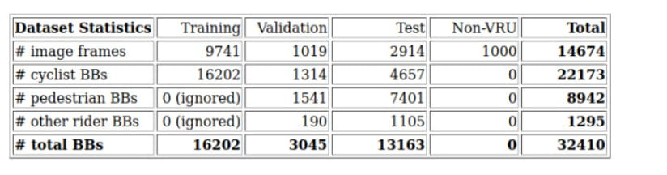
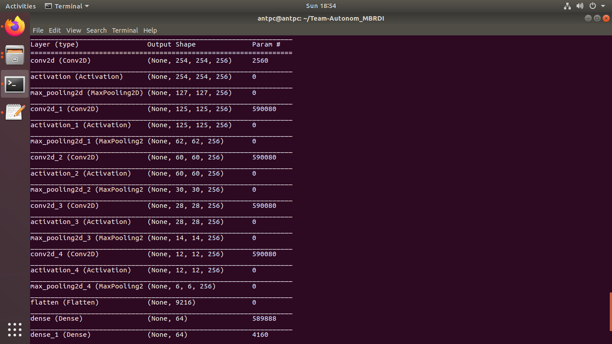

# Team-Autonom
Repository for work on Mercedes Benz Digital Challenge 2020 Hackathon

## Usage
1. Clone the Repository.
2. To setup environment for running inference code. Use the requirements.txt provided in the repository.
```
$ pip3 install -r requirements.txt 
```
3. The `custom model` used is the `cyclist-CNN_custom_architecture.model` file.
> Specification of model is discussed below.
4. For performing inference use the predictor.py (for image) or prediction_video.py (for video) 
5. The model can be converted to lighter tflite model for use in constrained embedded devices. 
```
$ python3 predictor.py
```

## Dataset Used
<a href="http://www.gavrila.net/Datasets/Daimler_Pedestrian_Benchmark_D/Tsinghua-Daimler_Cyclist_Detec/tsinghua-daimler_cyclist_detec.html">`Tsinghua-Daimler Cyclist Detection Benchmark Dataset`</a>

## Dataset Specifications


## Architecture 



